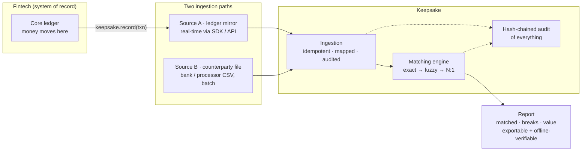
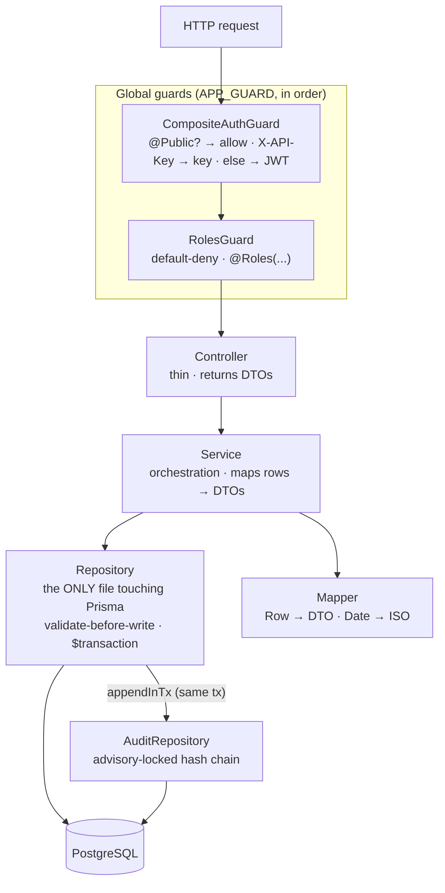
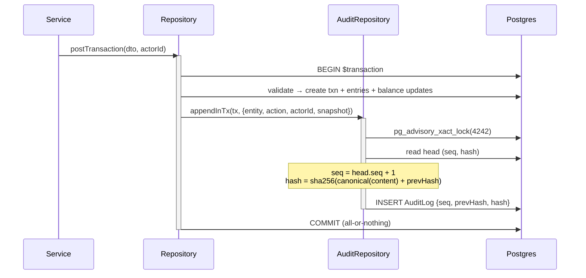
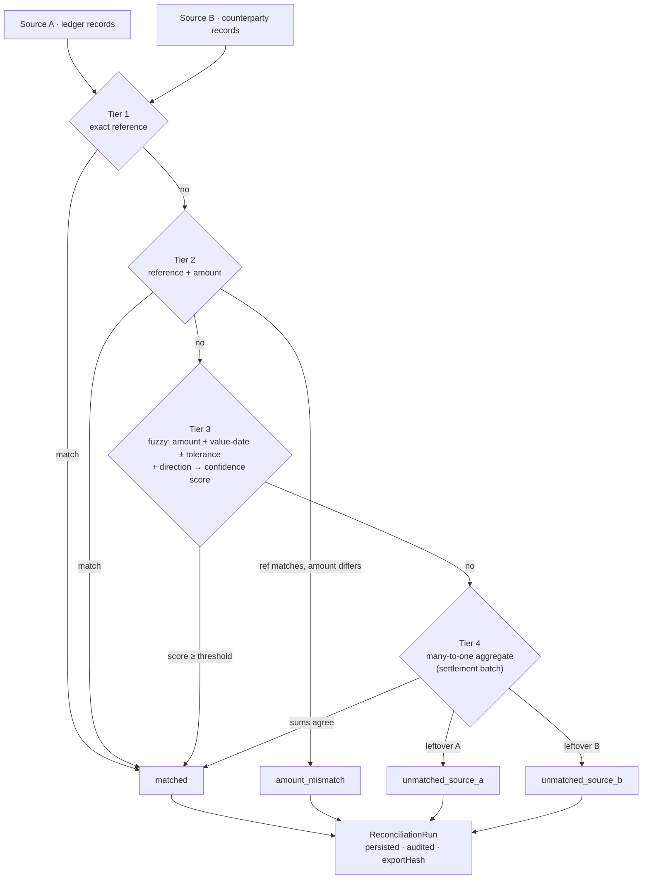
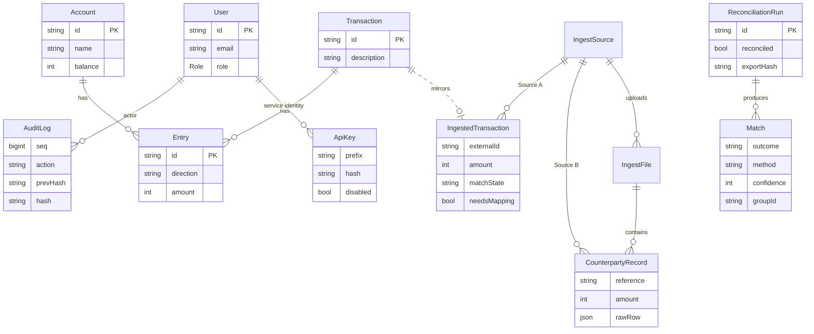
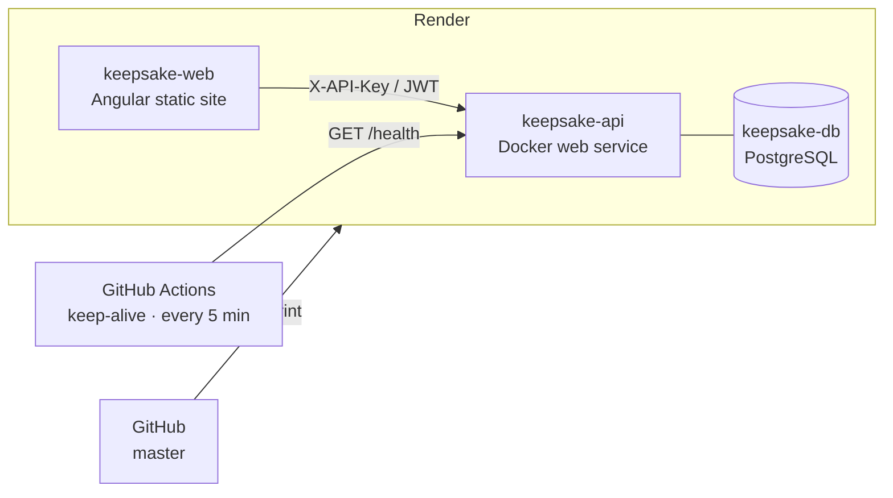

<div align="center">

# Keepsake

**A tamper-evident audit &amp; reconciliation layer for financial ledgers.**

Keepsake sits *beside* a fintech's ledger — their money never routes through it. It ingests two independent records of the same money, **cryptographically proves the ledger is internally consistent**, and **reconciles it against an outside source**, surfacing exactly where — and by how much — they disagree. Every record is hash-chained, so the entire pipeline is tamper-evident and verifiable offline.


</div>

---

## Table of contents

- [Why it exists](#why-it-exists)
- [The model in one picture](#the-model-in-one-picture)
- [Engineering highlights](#engineering-highlights)
- [Architecture](#architecture)
  - [Layered backend](#layered-backend)
  - [Tamper-evident audit (hash chain)](#tamper-evident-audit-hash-chain)
  - [The reconciliation engine](#the-reconciliation-engine)
- [Data model](#data-model)
- [API reference](#api-reference)
- [Tech stack](#tech-stack)
- [Running it locally](#running-it-locally)
- [Testing](#testing)
- [Deployment](#deployment)
- [The client SDK](#the-client-sdk)
- [Security model](#security-model)
- [Engineering principles](#engineering-principles-on-display)
- [Project structure](#project-structure)
- [License](#license)

---

## Why it exists

Reconciliation is where fintechs lose real money and fail audits. Two systems that *should* agree — a company's own ledger and an independent record of the same movement (a bank statement, a processor's settlement file) — drift apart through fees, FX, timing, duplicates, and bugs. Finding those breaks by hand is slow and error-prone; proving to a regulator that the books weren't quietly edited afterward is harder still.

Keepsake solves both:

- **Correctness by construction.** Double-entry postings are atomic and balanced; money is stored as integer minor units (never floats).
- **Tamper-evidence.** Every mutation is appended to a SHA-256 **hash chain** — altering any historical record breaks verification, and exports can be re-verified with zero database access.
- **Reconciliation as a first-class product.** A tiered matching engine (exact → fuzzy → many-to-one) reconciles the ledger against an independent record and reports precisely where they break — with drill-in to both raw sides.

It's designed to be **additive and low-risk** to adopt: the fintech pushes a mirror of its ledger with one line of code, and keeps their money exactly where it is.

---

## The model in one picture

Two independent records of the same money flow in. Keepsake proves they agree — or shows exactly where they don't — and keeps a tamper-evident history of everything it ingested.



**Three layers of proof** build on each other:

| Layer | Question it answers | Inputs |
| --- | --- | --- |
| **L1 — Internal integrity** | Is our mirror internally consistent? (balances derive, chain valid, txns self-balance, no orphans) | Source A |
| **L2 — Source-to-mirror** | Did every transaction the fintech recorded actually reach Keepsake? | Source A + digest |
| **L3 — External reconciliation** | Does the ledger agree with an *independent* record of the same money? | Source A + Source B |

L3 is the product; L1/L2 are the trust foundation beneath it.

---

## Engineering highlights

- **Cryptographic audit chain** — `hash = sha256(canonical(record) + prevHash)`; appends are serialized with a Postgres **advisory lock** so `seq`/`prevHash` are always computed against a stable head. Ships with **offline verifiers** that replay the chain and re-derive an export's hash with no DB access.
- **Race-safe idempotency** — ingestion is keyed by a DB `unique(source, externalId)` and recovers from the unique-violation (`P2002`) instead of a lossy read-then-write, so concurrent client retries are safe.
- **ACID money handling** — a posting validates `Σ debits == Σ credits` and writes the transaction, its entries, the balance updates, and the audit row **atomically** in one `$transaction`; invalid input persists *nothing*.
- **A real matching engine** — tiered exact-reference → reference+amount → **fuzzy (amount + value-date tolerance + direction, confidence-scored)** → **many-to-one settlement-batch aggregation**, with **stateful breaks that self-heal** when the missing side later arrives.
- **Two auth schemes, one guard** — a composite guard accepts either a human **JWT (argon2)** or a machine **API key** mapped to a `service`-role identity, then a default-deny `RolesGuard` authorizes uniformly.
- **Tested against a real database** — **100 automated tests** (72 API integration tests against a real Postgres — never mocked — plus 28 frontend specs), including **adversarial tests** that prove each invariant can actually fail.

---

## Architecture

A pnpm + Turborepo monorepo: a **NestJS** API, an **Angular** SPA, and a published **TypeScript SDK**, over **PostgreSQL** via **Prisma 7**.

### Layered backend

Every module follows the same strict shape, and the layer boundaries are enforced, not conventional: **Prisma is imported only in `*.repository.ts`**, controllers return DTOs (never Prisma models), and the mapper is where `Date` becomes an ISO string. Authentication and authorization are global guards.



### Tamper-evident audit (hash chain)

Every business mutation appends an audit row **inside the same transaction** as the write it describes. The append is serialized by a transaction-scoped advisory lock, so the chain head is stable even under concurrent posts. Any later edit to a historical row changes its hash and breaks every link after it — which `GET /audit/verify` (and the offline verifier) detects.



### The reconciliation engine

Given a window of Source A (ledger) and Source B (counterparty) records, the engine tries the cheapest, highest-confidence match first and falls through to progressively fuzzier tiers. Every match decision is hash-chained, and the whole run is persisted with an offline-verifiable `exportHash`.



Breaks are **stateful, not one-shot**: reconciliation is re-runnable over a window and matches whatever is present, so an `unmatched_source_a` break **auto-resolves** on the next run once the counterparty side arrives.

---

## Data model

Money is integers (minor units); `direction` carries the sign. The audit chain (`seq`/`prevHash`/`hash`) is append-only; ingestion/reconciliation sit alongside the ledger and link back to it via `IngestedTransaction.transactionId`.



---

## API reference

All routes are JWT-guarded and **default-deny** (a route with no `@Roles` is admin-only). `/ingest/*` also accepts an `X-API-Key`. Roles: `admin` · `accountant` · `auditor` · `viewer` · `service` (API key).

| Area | Method &amp; path | Roles | Purpose |
| --- | --- | --- | --- |
| **Auth** | `POST /auth/register` · `POST /auth/login` | public | Register / obtain a JWT |
| | `GET /auth/me` | any | Current principal |
| **Ledger** | `POST /transactions` | admin, accountant | Post a balanced transaction (atomic, audited) |
| | `GET /accounts` · `GET /transactions` | any | Read balances / transactions |
| | `GET /reconcile` | admin, accountant, auditor | L1 internal-integrity report (4 checks) |
| | `GET /accounts/as-of` · `GET /transactions/as-of` | admin, accountant, auditor | Point-in-time ("as-of") state |
| | `GET /export` | admin, accountant, auditor | Self-verifying export document (`exportHash`) |
| **Audit** | `GET /audit` · `GET /audit/archive` · `GET /audit/verify` | admin, accountant, auditor | Chain, archived prefix, verification result |
| **Ingestion** | `POST /ingest/transactions` · `/batch` | service, admin, accountant | Source A push (idempotent) |
| | `POST /ingest/files` · `GET /ingest/files/:id` | service/admin/accountant · readers | Source B CSV upload + parse results |
| | `GET /ingest/needs-mapping` | admin, accountant, auditor | Records that couldn't resolve an account |
| **Sources** | `GET /sources` · `POST /sources` · `POST /sources/:id/mapping` | readers · admin · admin | Register sources + mapping profiles |
| **Reconciliation** | `POST /reconciliation/runs` | admin, accountant | Run L3 over a window (A vs B) |
| | `GET /reconciliation/runs` · `GET /reconciliation/:runId` | admin, accountant, auditor | Run history + full report |
| | `POST /matches/:id/confirm` | admin, accountant | Human-confirm a fuzzy match (audited) |
| **Admin** | `GET/PATCH /users/*` · `GET/PUT/POST /retention/*` · `*/api-keys` | admin | Users, retention/archival, API keys |
| **Ops** | `GET /health` | public | Liveness probe |

---

## Tech stack

| Layer | Choices |
| --- | --- |
| **Language** | TypeScript (strict) end-to-end |
| **API** | NestJS 11 · Prisma 7 (`prisma-client` generator + `@prisma/adapter-pg`) · argon2 · Passport-JWT · class-validator · `@nestjs/schedule` |
| **Database** | PostgreSQL 16 |
| **Frontend** | Angular 19 (standalone components + **signals**) · TanStack Query · Tailwind CSS v4 · a hand-built "Sluice" design system |
| **SDK** | Zero-dependency, fetch-based TypeScript client (`keepsake-sdk`) |
| **Tooling** | pnpm workspaces · Turborepo · Jest · Karma · ESLint/Prettier |
| **Delivery** | Docker · Render (Infrastructure-as-Code Blueprint) · GitHub Actions |

---

## Running it locally

**Prerequisites:** [Docker Desktop](https://www.docker.com/) running, Node.js 22.12+, and `pnpm` (`npm i -g pnpm`).

```bash
pnpm install                                   # 1. install the workspace

docker compose up -d                           # 2. Postgres 16 (host port 5544)

pnpm --filter api exec prisma migrate deploy   # 3. apply the schema
pnpm --filter api exec prisma db seed          # 4. seed accounts + demo data

pnpm dev                                        # 5. API (:3000) + web (:4200)
```

Open **http://localhost:4200** and sign in (all seeded users share the password `password123`):

| Email | Role | Can |
| --- | --- | --- |
| `admin@keepsake.local` | admin | everything (users, retention, API keys, integrations) |
| `accountant@keepsake.local` | accountant | post, reconcile, ingest, export |
| `auditor@keepsake.local` | auditor | view / audit / reconcile / verify / export (no posting) |
| `viewer@keepsake.local` | viewer | view the ledger |

> **Port note:** Postgres is published on **5544** (not 5432) to avoid a native Postgres service. **Prisma 7 note:** the client is generated into `apps/api/src/generated/prisma` and the connection URL lives in `prisma.config.ts`; `migrate reset` does not auto-seed in v7 — run `prisma db seed` after a reset.

---

## Testing

The guarantees here are *database* guarantees, so the API tests run against a **real PostgreSQL** (a dedicated `keepsake_test` DB the harness refuses to run outside of), truncating and reseeding between tests.

```bash
pnpm --filter api test    # 72 integration + unit tests (needs Docker Postgres up)
pnpm --filter web test    # 28 component / logic specs (headless)
```

Coverage includes idempotent duplicate ingestion, audit-chain continuity under **concurrent** posts, every matching tier and outcome (incl. N:1 and re-run self-healing), API-key auth (valid/revoked/none), and export **tamper-detection**. Crucially, each invariant has at least one **adversarial** test — a check proven able to fail (break the code, watch it go red, restore) — so the green suite means something. See [`TESTING.md`](TESTING.md).

---

## Deployment

Deployed on **Render** from a single Infrastructure-as-Code Blueprint ([`render.yaml`](render.yaml)): a Dockerized API, an Angular static site, and a managed Postgres — with the API URL and CORS origin **cross-wired between services** (no hand-entered URLs). Migrations and the seed run at container start; `GET /health` gates the deploy.



A scheduled **GitHub Actions** workflow pings `/health` every 5 minutes so the free-tier API never cold-starts during a demo. Full walkthrough in [`DEPLOY.md`](DEPLOY.md).

---

## The client SDK

Integration is one line at the fintech's commit point. The SDK (`keepsake-sdk`) is a zero-dependency, fetch-based client with built-in idempotency and retry-with-backoff.

```ts
import { createKeepsake } from 'keepsake-sdk';

const keepsake = createKeepsake({ baseUrl: 'https://…', apiKey: 'sk_live_…' });

await keepsake.record({
  externalId: 'txn_9f8a',                 // your id — the idempotency + join key
  occurredAt: new Date().toISOString(),
  source: 'core-ledger',
  entries: [
    { account: 'settlement:pending', direction: 'debit',  amount: 420000 }, // minor units
    { account: 'bank:access',        direction: 'credit', amount: 420000 },
  ],
});
```

Idempotent by `externalId` (safe to retry); transient 5xx/network errors retry with exponential backoff.

---

## Security model

- **Authentication** — stateless JWTs, **re-validated against the DB on every request** (disabling a user takes effect immediately); passwords hashed with **argon2** (memory-hard). Machine callers use hashed **API keys** (only a prefix + argon2 hash stored; plaintext shown once).
- **Authorization** — global `RolesGuard`, **default-deny**: any route without explicit `@Roles` is admin-only.
- **Integrity** — the hash chain makes silent history edits detectable; retention **archives-then-prunes** so the archived prefix stays independently verifiable.
- **Data hygiene** — parameterized queries via Prisma (no SQL injection); secrets kept out of the repo (`.env` git-ignored; `JWT_SECRET` generated at deploy); CORS restricted to the configured web origin.

---

## Engineering principles on display

**SOLID** throughout — e.g. *Open/Closed* (new audited actions plug into the chain with no core change), *Dependency Inversion* (services depend on injected repositories; the generated client is isolated to one file). Plus **single source of truth** (Postgres authoritative; cached balances reconciled against derived), **fail-fast** (validate-before-write), **defense-in-depth** (validation at DTO *and* repository layers), **least privilege** (default-deny RBAC, scoped service identities), **immutability** (append-only audit), and **determinism** (canonical hashing → reproducible, offline-verifiable exports).

---

## Project structure

```
keepsake/
├─ apps/
│  ├─ api/                      NestJS 11 + Prisma 7
│  │  ├─ prisma/                schema.prisma · migrations · seed.ts
│  │  ├─ src/
│  │  │  ├─ common/             guards (composite-auth, roles) · decorators · crypto (audit-hash)
│  │  │  ├─ prisma/             PrismaService (the only PrismaClient)
│  │  │  └─ modules/            auth · ledger · audit · reconciliation · ingestion · apikeys · retention
│  │  ├─ scripts/               offline verifiers (verify-export, verify-chain)
│  │  └─ test/                  integration suites (real Postgres)
│  └─ web/                      Angular 19 + Tailwind v4 + TanStack Query
│     └─ src/app/
│        ├─ core/               api clients · models · auth store + guards
│        └─ features/           ledger · post · audit · reconciliation · integrations · pitr · admin
├─ packages/sdk/                keepsake-sdk — zero-dependency TypeScript client
├─ .github/workflows/           keep-alive cron
├─ render.yaml                  Infrastructure-as-Code Blueprint
└─ docker-compose.yml           PostgreSQL 16
```

---

## License

[MIT](LICENSE) © Maxima24

<div align="center"><sub>Built as a demonstration of correctness-critical financial systems engineering.</sub></div>
